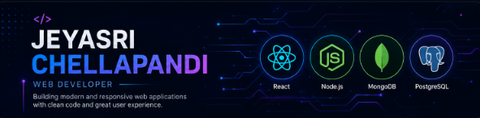
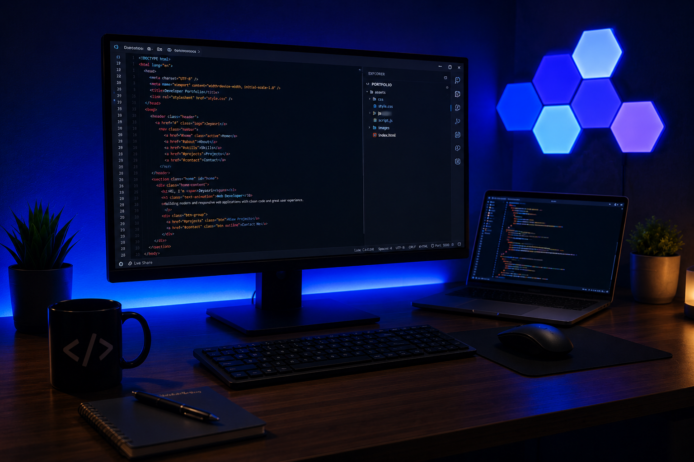

<div align="center">



<br><br>


<br><br>

<a href="https://www.linkedin.com/in/jeyasrichellapandi18">

</a>

&nbsp;

<a href="https://github.com/JEYASRIC17">

</a>

</div>

---

# About Me

<table>

<tr>

<td width="58%" valign="top">

### Hello!

I'm **Jeyasri Chellapandi**, a passionate **Web Developer** who enjoys building modern, responsive and user-friendly web applications.

I mainly work with the **MERN Stack** and enjoy transforming ideas into practical applications with clean UI, efficient backend logic and structured databases.

Currently I'm strengthening my **problem-solving skills using Java** while continuously improving my web development knowledge.

### Interests

- Responsive Web Development
- Backend Development
- REST API Design
- Database Design
- Clean UI & UX
- Continuous Learning

</td>

<td width="42%" align="center">



</td>

</tr>

</table>

---

# Tech Stack

<table>

<tr>

<td align="center" width="25%">

### Frontend


</td>

<td align="center" width="25%">

### Backend


</td>

<td align="center" width="25%">

### Database


</td>

<td align="center" width="25%">

### Languages


</td>

</tr>

</table>

---

# Tools I Use

<div align="center">


<br><br>


&nbsp;


</div>

---

# Current Focus

<table>

<tr>

<td width="50%">

### Currently Learning

- Backend Architecture
- PostgreSQL
- REST API Best Practices
- Java (Data Structures & Algorithms)
- Writing Clean Code

</td>

<td width="50%">

### Development Goals

- Build production-ready MERN projects
- Improve backend architecture skills
- Learn scalable application design
- Contribute to open source
- Keep learning modern technologies

</td>

</tr>

</table>

---

# Featured Projects

> Public projects will be showcased here as they become available.

| Project | Description | Tech Stack |
|---------|-------------|------------|
| Portfolio Website | Personal portfolio showcasing my skills and projects. | HTML, CSS, JavaScript |
| MERN Projects | Practical full-stack applications built while learning. | React, Node.js, Express, MongoDB |
| Upcoming Projects | More public repositories coming soon. | In Progress |

---
# GitHub Activity

<div align="center">


<br><br>


</div>

---

# GitHub Overview

<div align="center">

<table>

<tr>

<td align="center">

### Contributions

Consistently improving through hands-on development, personal projects and continuous learning.

</td>

<td align="center">

### Focus

Building responsive web applications with modern frontend and backend technologies.

</td>

<td align="center">

### Goal

Write clean, maintainable and scalable code while continuously improving problem-solving skills.

</td>

</tr>

</table>

</div>

---

# Development Workflow

<div align="center">

```text
Idea
  │
  ▼
Planning
  │
  ▼
UI Design
  │
  ▼
Frontend Development
  │
  ▼
Backend Development
  │
  ▼
Database Integration
  │
  ▼
Testing
  │
  ▼
Deployment
```

</div>

---

# Development Environment

<div align="center">

| Category | Technologies |
|-----------|--------------|
| Operating System | Windows |
| Code Editor | VS Code |
| Java IDE | IntelliJ IDEA |
| API Testing | Thunder Client |
| Version Control | Git & GitHub |
| Design | Canva |
| Database | PostgreSQL, MongoDB |

</div>

---

# Connect With Me

<div align="center">

<a href="https://www.linkedin.com/in/jeyasrichellapandi18">

</a>

&nbsp;&nbsp;&nbsp;&nbsp;&nbsp;

<a href="https://github.com/JEYASRIC17">

</a>

</div>

<br>

<div align="center">

<a href="https://www.linkedin.com/in/jeyasrichellapandi18">

</a>

&nbsp;

<a href="https://github.com/JEYASRIC17?tab=repositories">

</a>

</div>

---

<div align="center">

### Thanks for visiting my profile.

*"Keep learning. Keep building. Keep improving."*

</div>

<br>

<div align="center">


</div>

---

# Repository Highlights

<div align="center">

The repositories below showcase my learning journey and practical web development experience.

As I continue building new applications, this section will grow with more complete and production-ready projects.

</div>

---

# What I'm Improving

<table>

<tr>

<td width="50%">

### Technical Skills

- Writing clean and maintainable code
- Component-based development
- Backend architecture
- Database design
- RESTful API development
- Problem solving using Java

</td>

<td width="50%">

### Professional Growth

- Building real-world applications
- Improving project structure
- Learning scalable development practices
- Exploring new web technologies
- Continuous self-learning

</td>

</tr>

</table>

---

# Development Philosophy

<div align="center">

> **"Great software is built by continuously learning, improving, and paying attention to the small details."**

</div>

---

# Technologies I Enjoy Working With

<div align="center">


</div>

---

# Current Learning Journey

```text
HTML & CSS
     │
     ▼
JavaScript
     │
     ▼
React
     │
     ▼
Node.js
     │
     ▼
Express.js
     │
     ▼
MongoDB
     │
     ▼
PostgreSQL
     │
     ▼
Java (Data Structures & Algorithms)
```

---

# Profile Summary

<div align="center">

| Area | Status |
|------|--------|
| Frontend Development | Improving |
| Backend Development | Improving |
| Database Design | Improving |
| REST APIs | Learning through Projects |
| Java (DSA) | Practicing |
| Version Control | Git & GitHub |

</div>

---

# Open to Opportunities

<div align="center">

I'm always interested in learning, collaborating and working on meaningful web development projects.

I enjoy solving problems, building responsive applications and continuously improving my technical skills.

</div>

---

<div align="center">

### Let's Connect

<a href="https://www.linkedin.com/in/jeyasrichellapandi18">

</a>

&nbsp;

<a href="https://github.com/JEYASRIC17">

</a>

</div>

---

<div align="center">


### Thank you for visiting my GitHub profile.

**Building • Learning • Growing**

</div>
